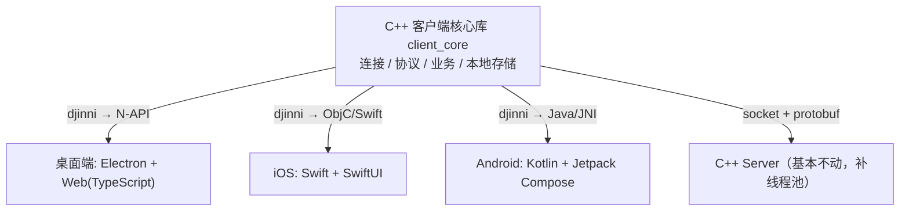
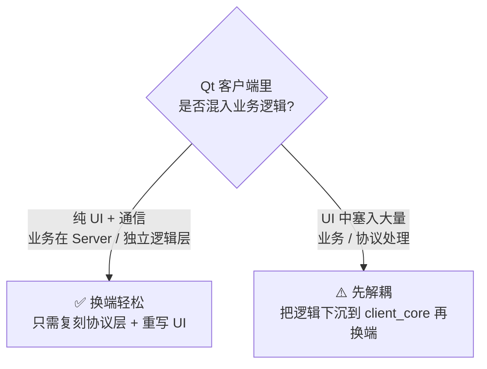
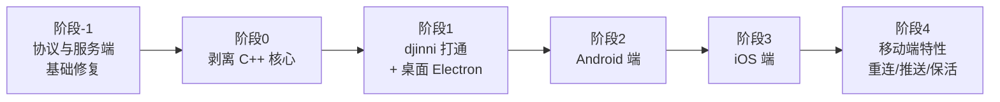

# IM 项目多端化改造规划文档

> 目标：将现有 **C/S 架构 IM 项目**（Qt 客户端 + C++ 服务端，Windows）改造为**一套 C++ 客户端核心 + 多端薄 UI（桌面/iOS/Android）**的跨平台方案，技术栈对齐腾讯 QQNT 原生技术栈（djinni + protobuf + wcdb + 原生 UI）。
>
> 文档状态：`规划中（已对齐代码现状）`　｜　最近更新：2026-08-02

---

## 1. 背景与现状

### 1.1 现有项目现状（基于代码分析，2026-08-02）

| 维度 | 现状 |
|---|---|
| 架构 | C/S（客户端 / 服务端分离），客户端与服务端 net/mediator/Kernel 三层镜像对称 |
| 客户端（C 端） | Qt 5（core + gui + widgets），**未用 Qt network 模块**，直接调 WinSock；仅 Windows |
| 服务端（S 端） | 纯 C++（无 Qt），VS 工程，强 Windows 依赖（WinSock2 + `_beginthreadex` + MySQL C API） |
| 构建系统 | 客户端 qmake（`IMClient.pro`）；服务端 VS 工程（`.vcxproj`）；**均无 CMake** |
| 数据库 | 服务端 MySQL 8.0（`libmysql`），表：`t_user` / `t_friend` / `offline_msg`；**SQL 用 `sprintf_s` 拼接，存在注入风险** |
| 本地存储 | **客户端完全没有本地持久化**（无 SQLite / QSettings / 任何缓存），好友列表与聊天记录仅存内存 |
| 线程模型 | 服务端 **thread-per-connection**（每 accept 一个连接 `_beginthreadex` 一个 recv 线程），**无线程池、无锁**，`m_mapIdtoSocket` / `m_addrFrom` 存在数据竞争；作者注释自述瓶颈约 2000 并发 |
| 功能完成度 | 已实现：注册 / 登录 / 单聊（文本 8KB 上限）/ 加好友 / 好友上下线通知 / 离线消息入库；**未实现**：群聊 / 文件传输 / 聊天记录持久化 / 用户资料修改 / 心跳保活 / 多端互踢 |

### 1.2 通信协议现状（与原规划对照修正）

原规划仅写"裸 TCP + 4 字节包长 + 二进制包体"。代码分析后发现存在 **4 个跨端硬伤**，必须在多端改造前解决：

| 项 | 现状 | 风险 | 必须修复 |
|---|---|---|---|
| 4 字节包长字节序 | **未做 `htonl/ntohl`**，直接 `(char*)&len` 传主机序 | Windows x86 双端小端能跑；接 ARM / 大端机 / 移动端即错位 | 显式统一为大端（网络序） |
| 长度含义 | 包体长度（不含 4 字节头） | 含义本身 OK | 明确写进协议文档 |
| 最大长度保护 | **无**，`new char[RecvLen]` 直接信任对端 | 恶意/异常包发 `0x7FFFFFFF` 即 OOM / DoS | 加 `MAX_PACK_LEN`（建议 10MB）校验 |
| 包体格式 | POD struct + `memcpy` 二进制，**无 `#pragma pack`** | 不同编译器/位数 `sizeof` 不同 → 协议错位 | 加 `#pragma pack(1)` 或迁 protobuf |
| 字符编码 | 客户端 UTF-8 ↔ GB2312 互转（因 VS 服务端用 GB2312） | 跨端编码混乱 | 全链路统一 UTF-8 |
| 消息类型 | `#define` 宏（非 enum class），靠 `m_dealFunArr[type-DEF_BASE]` 函数指针数组分发 | 越界风险 | 改 enum class + 范围校验 |

> **结论**：协议层不能"原样复用"，必须先做基础修复（见阶段 -1）。是否一步到位迁 protobuf，取决于是否愿意承担 5-8 天的协议迁移成本（含客户端 net 层同步改造与新老协议兼容窗口）。

### 1.3 客户端架构与耦合度（决定阶段 0 难度）

| 层 | 文件 | 职责 | 依赖 Qt | 依赖 Windows | 可复用度 |
|---|---|---|---|---|---|
| UI | `logindia` / `mainwdiget` / `Frienditem` / `chatdig` | 4 个 Qt 窗口 | 是 | 否 | 各端重写 |
| 控制中心 | `kernal.cpp/h` | 协议拼装 + 分发 + **直接 new 并持有 LoginDia/mainwdiget** + **直接弹 QMessageBox** + QTimer | **是** | 否（间接） | **需逐函数剥离** |
| 中介 | `mediator/TCPClientmediator` | net↔kernal 信号转发 | 是 | 否（基类含 winsock2.h） | 接口可借鉴，实现重写 |
| 网络 | `net/TCPClient` / `net/INet` | WinSock + `_beginthreadex` 接收线程 | 否 | **是** | **整体重写** |
| 协议 | `net/def.h` | 协议 struct / 宏 | 否 | 否 | **高（需小改）** |
| 死代码 | `net/UDP*` / `net/TCPServer*` / `mediator/UDP*` / `mediator/TCPServer*` | 客户端不用的 UDP/服务端实现 | — | — | 删除 |

**关键发现**：`kernal` 类名义上是"内核"，实际是 **UI 协调器 + 协议处理器的混合体**，与 Qt 深度耦合——不能直接复用为 `client_core`。`kernal.cpp` 中的 `m_pUpateFriTimer` / `m_pAddFriendTimer` / `m_pFriofflineTimer` 是**模拟服务端的测试代码**（自己给自己发包），非真实功能，剥离时直接删除。

### 1.4 改造诉求

1. **桌面端不再用 Qt**，改用其他现代技术栈。
2. **新增移动端**（iOS + Android），当前零基础，需从零实现。
3. **学习目标**：练习 QQNT 原生技术栈（djinni 跨端绑定 + 原生 UI + C++ 核心）。

---

## 2. 目标架构

核心理念：**薄 UI + 厚 C++ 核心**。客户端的"连接管理、协议收发、业务逻辑、本地存储"全部下沉到一个与 UI 无关的 C++ 核心库，各端仅实现自己的 UI 壳，通过 djinni 生成的绑定调用同一份核心。

### 2.1 分层职责

| 层 | 职责 | 是否复用 |
|---|---|---|
| C++ 客户端核心 `client_core` | 连接管理、协议编解码、业务逻辑、本地存储、日志 | 全端 100% 复用 |
| djinni 绑定层 | 由 `.djinni` IDL 自动生成各端语言绑定 | 自动生成 |
| 各端 UI 层 | 界面渲染、交互、平台特性（推送/保活） | 各端独立实现 |
| C++ Server | 服务端逻辑（补线程池优化） | 基本不动 |

---

## 3. 技术栈选型

| 层 | 选型 | 对应 QQNT 的组件 |
|---|---|---|
| 客户端核心 | C++（CMake 管理，Google C++ Style） | QQNT-Kernel |
| 跨端绑定 | **djinni** | `third_party/djinni` + `wrapper/script/*.djinni` |
| 通信协议序列化 | **protobuf** | `third_party/protobuf` |
| 本地加密存储 | **sqlcipher / wcdb** | `foundation/wcdb` |
| 高性能 KV | **MMKV**（配置/会话状态） | `third_party/MMKV` |
| 加密 | **TEA / ECDH** | `foundation/tea_ng`、`foundation/ecdh_util` |
| 异步日志 | **xlog（mars）思路** | `third_party/QQXlog` |
| 长连接 | 自研，参考 QQNT 设计 | `foundation/long_cnn` |
| 桌面 UI | **Electron + TypeScript** | `wrapper/` + 桌面端 |
| iOS UI | **Swift + SwiftUI** | djinni ObjC 绑定 |
| Android UI | **Kotlin + Jetpack Compose** | djinni Java + JNI 绑定 |

---

## 4. 换前端 / 多端的可行性判断

C/S 架构天生为"换前端"留了空间：**只要客户端与服务端通过明确协议（socket + 序列化）通信，前端技术栈与服务端无关**。换端是否顺利，取决于当前 Qt 客户端内业务逻辑与 UI 的耦合度。

> 结论：无论哪种情况，**阶段 0「剥离 C++ 核心」都是整个改造的地基**，也顺带完成"薄 UI + 厚核心"的架构升级。

---

## 5. 分阶段路线图

每个阶段均有**可运行产出**，跑通后再进入下一阶段，避免一次性大爆炸重写。

### 阶段 -1：协议与服务端基础修复（前置，1 周内）

> 代码分析后发现协议层有 4 个跨端硬伤（字节序 / 长度保护 / struct 对齐 / 编码），服务端有 SQL 注入与无线程池。这些不修，多端改造无法启动。
>
> **实施进度（2026-08-03）**：代码改动已完成（macOS 编辑，待 Windows 验证），详见 `docs/phase_minus_1_verification.md`。

- **目标**：在**不改动业务功能**的前提下，把协议与服务端补到"可安全跨端"的基线。
- **产出**：
  1. ✅ 客户端 + 服务端 `def.h` 加 `#pragma pack(1)` + `MAX_PACK_LEN` 宏 + 补齐客户端 `DEF_PROT_COUNT` + 范围校验（`enum class` 迁移留阶段 0）；
  2. ✅ `sendData/recvData` 加 `htonl/ntohl` 字节序转换 + 长度上限校验 + 异常路径内存释放；
  3. ✅ 服务端 `CMySql` 用 `mysql_real_escape_string` 修 SQL 注入（真正的 `mysql_stmt_*` 预处理留阶段 0）；
  4. ✅ 服务端 `m_mapIdtoSocket` / `m_addrFrom` 加锁消除数据竞争；⏸ **worker 线程池推迟到阶段 0**（与 asio 重写合并，详见下方决策说明）；
  5. ✅ 全链路编码统一 UTF-8（删 `utf8ToGb2312` 互转，MySQL 连接改 `utf8mb4`，表字符集待 Windows 侧 ALTER）。
- **验证**：原 Qt 客户端 + 修复后服务端能正常注册 / 登录 / 单聊 / 加好友（功能不回归）。验证清单见 `docs/phase_minus_1_verification.md`，含 13 个回归用例（含 SQL 注入 / 恶意包 / 并发测试）。
- **不做**：不迁 protobuf（留 P2 二期）、不做跨平台（留阶段 0/1）、不删 UDP 死代码（留阶段 0）、不做 worker 线程池（留阶段 0）。
- **预估**：3-4 天（P0 必改项合计）。代码改动已完成，剩余为 Windows 编译验证 + MySQL 迁移。

> **决策说明：worker 线程池为何推迟**：方案 A 的任务队列 + worker 池是大型并发架构改造，在无法编译验证下风险过高；且与阶段 0「服务端 asio 重写」高度重叠（asio 自带 reactor 线程模型），做两次反而浪费。本次只做加锁（消除数据竞争这个 P0 安全项），性能优化留到阶段 0 一次到位。

### 阶段 0：剥离 C++ 客户端核心（地基，最关键）

- **目标**：把"连接管理、协议收发、业务逻辑、本地存储"从 Qt 代码剥离为独立 C++ 库。
- **产出**：不依赖 Qt、可独立编译（CMake）的 `client_core` 静态库。
- **难度**：**中等偏上**（原规划未评估，代码分析后修正）
  - 有利：协议定义集中（`def.h`）、UI 与逻辑有初步分层、无第三方库纠缠、功能面小；
  - 不利：net 层纯 WinSock 必须整体重写、`kernal` 与 Qt 深度耦合需逐函数改写、本地存储从 0 开始、无 CMake 需新建。
- **子任务**：
  1. **新建 CMake 工程** `client_core/`，目录结构：`include/`（对外接口）、`src/`（实现）、`third_party/`（asio 等）、`tests/`（单元测试）。
  2. **抽协议层**：`def.h` + 序列化层（纯 C++ 无 Qt），加 `#pragma pack(1)`（阶段 -1 已做一半）。
  3. **重写 net 层**：用 **asio**（跨平台，无 Qt 依赖）或 **Qt network**（若核心允许依赖 Qt）替换 WinSock；保留"先 4 字节包长再包体"的二段式协议。
  4. **剥离 `kernal` 业务逻辑**：把 `deal_xxx` 协议解析逻辑抽到 `client_core`，所有 UI 调用（`QMessageBox` / `m_Mainwdiget->setXxx` / `m_pLogin->show()`）改为**抽象回调接口**（观察者 / 事件回调）上抛给 UI 层。
  5. **删除死代码**：`net/UDP*` / `net/TCPServer*` / `mediator/UDP*` / `mediator/TCPServer*` / `kernal.cpp` 中的三个模拟定时器。
  6. **从 0 搭建本地存储**：建议 SQLite（或后续接 wcdb/sqlcipher），存用户信息 / 好友列表 / 聊天记录。
  7. **Qt 客户端验证**：原 Qt UI 改为调用 `client_core`（通过回调接收事件），功能不回归即算阶段 0 通过。
- **前置确认**：阶段 -1 已完成（协议基线 OK）。
- **关键决策点**：`client_core` 是否允许依赖 Qt？
  - **允许**（Qt network + core）：工作量降一档，但 iOS/Android 绑定需额外处理 Qt 依赖；
  - **不允许**（纯 C++ + asio）：工作量大一档，但 djinni 绑定 iOS/Android 最干净。
  - 建议选**不允许**（纯 C++），对齐 QQNT 内核设计。

### 阶段 1：djinni 打通 + 桌面端换 Electron

- **目标**：写第一个 `.djinni` 接口（如 `login` / `sendMessage` / `onMessageReceived` 回调），生成 N-API 绑定，Electron 前端调用 C++ 核心。
- **产出**：能登录、能收发消息的 **Electron 桌面版**（Qt 下线）。
- **需掌握**：djinni IDL 语法、Electron 基础、TypeScript。
- **前置**：阶段 0 产出可独立编译的 `client_core`。

### 阶段 2：Android 端（移动端优先做）

- **目标**：同一套 `.djinni` 生成 Java + JNI 绑定，Kotlin + Compose 写 UI。
- **产出**：可运行的 Android App。
- **需掌握**：Kotlin 基础、Jetpack Compose、Android Studio、JNI 打包 `.so`。
- **为什么先做 Android**：模拟器免费、无需 Mac、调试链路更易上手。

### 阶段 3：iOS 端

- **目标**：同一套 `.djinni` 生成 ObjC 绑定，Swift 调用，SwiftUI 写 UI。
- **产出**：可运行的 iOS App。
- **需掌握**：Swift 基础、SwiftUI、Xcode（需 Mac）。

### 阶段 4：移动端 IM 特性补齐

- **目标**：补齐移动端特有能力，从 demo 走向"真能用"。
  - 长连接心跳 / 断线重连（参考 QQNT `long_cnn`）
  - 后台保活 + 推送（iOS APNs / Android FCM 或厂商推送）
  - 弱网 / 网络切换自动重连
  - 省电省流量（心跳间隔、消息批量拉取）
- **产出**：一个可实际使用的移动 IM。
- **前置**：服务端心跳 / 断线检测（P1 推荐项）需先完成。

---

## 6. 移动端 IM 特有挑战

移动端并非"桌面端搬过去"，以下为必须处理项：

| 问题 | 说明 | 参考 QQNT 组件 |
|---|---|---|
| 后台保活 / 推送 | App 切后台长连接会被系统杀死 → iOS APNs、Android FCM/厂商推送 | — |
| 弱网 / 网络切换 | WiFi↔4G 切换需自动重连，长连接需心跳保活 | `long_cnn` |
| 省电省流量 | 心跳间隔、消息批量拉取优化 | `traffic_monitor` |
| 本地存储 | iOS/Android 沙盒路径不同，需跨端封装 | `wcdb` / `sqlcipher` |
| 协议兼容 | 移动端与桌面端连同一 Server，协议需统一 | `protobuf` |

---

## 7. 服务端改造（与阶段 -1 并行推进）

> 原规划写"服务端基本不动，补线程池"。**代码分析后修正：仅补线程池不够**，至少需完成下表「必改」项，服务端才具备多端改造的前置条件。

### 7.1 改造清单（按优先级）

| 优先级 | 项 | 难度 | 工作量 | 说明 |
|---|---|---|---|---|
| **P0 必改** | 加包长上限保护 | 容易 | 0.5 天 | `recv` 4 字节后校验 `RecvLen <= MAX_PACK_LEN`（10MB），否则关连接 |
| **P0 必改** | 字节序规范化 | 容易 | 0.5 天 | send/recv 处加 `htonl/ntohl`，与客户端协议修复同步 |
| **P0 必改** | 修 SQL 注入 | 容易 | 0.5 天 | `sprintf_s` 拼 SQL → `mysql_real_escape_string` 或预处理语句（`mysql_stmt_*`） |
| **P0 必改** | 补线程池 + 加锁 | 容易 | 1-2 天 | 方案 A：保留 `recvThread` 模型，改投递任务队列 + 固定 worker 池；`m_mapIdtoSocket` / `m_addrFrom` 加 `std::mutex` 或换并发容器。**阶段-1 已完成加锁**；worker 池推迟到阶段 0 与 asio 重写合并 |
| P1 推荐 | 跨平台（Win→Linux） | 中等 | 3-5 天 | net 层 `WinSock2`→`<sys/socket>`、`_beginthreadex`→`std::thread`、`HANDLE`→`pthread`；`Kernel` 业务层可保留 |
| P1 推荐 | 心跳 / 断线检测 | 中等 | 2 天 | 新增心跳协议 + 超时清理 map，移动端必需 |
| P2 二期 | 协议迁 protobuf | 中等-困难 | 5-8 天 | `def.h` 全部 struct 重写为 `.proto`，客户端 net 层同步改造，需新老协议兼容窗口 |
| P3 远期 | 群聊 / 文件传输 | 困难 | 1-2 周 | 新协议 + 新表 + 文件存储方案 |

### 7.2 可保留 vs 需重构

- **可保留**：`Kernel` 业务分发框架（函数指针数组设计清晰）、`CMySql` 封装（接口合理，实现需改预处理）、`def.h` 协议枚举（可演进）、mediator 中介者分层。
- **需重构**：`TCPServer` net 层（强 Windows 耦合 + 阻塞模型）、`sendData/recvData`（无字节序 / 无长度校验 / 无锁）、`Kernel::m_mapIdtoSocket`（需加锁或换并发容器）、SQL 拼接（必须改预处理）。

### 7.3 线程池改造方案

- **方案 A（最小改动 / 推荐）**：保留现有 `recvThread` 模型，加入固定大小线程池 + 任务队列。`recvThread` 改为只负责把 `(pack, len, socket)` 投递到队列，由工作线程消费。需对 `m_mapIdtoSocket` 加 `std::mutex`。
- **方案 B（中等）**：迁 Linux + epoll，`TCPServer` 重写为 reactor，保留 `Kernel` 业务层。
- **方案 C（彻底）**：迁 asio/muduo，net 层全部重写。

> 建议走方案 A：工作量 1-2 天，业务层几乎不动，能解决并发瓶颈与数据竞争。方案 B/C 留待 Linux 化时再评估。

---

## 8. 前置准备（不依赖协作，可先行）

1. **开发环境**
   - VS Code + CMake + asio（阶段 0，client_core 跨平台核心）
   - VS Code + Node.js（阶段 1，Electron）
   - Android Studio（阶段 2）
   - Xcode + Mac（阶段 3，如有 Mac）
2. **已确认的关键信息**（原列为"待确认"，2026-08-02 代码分析后已明确）：
   - 协议格式：**裸 TCP + 4 字节包长（小端本机序）+ POD struct 包体**，包长含义为"仅包体长度"。
   - 字节序 / 长度保护 / struct 对齐 / 编码 4 项硬伤 → 阶段 -1 修复。
   - 是否走 WebSocket：**否**，维持裸 TCP。
   - `client_core` 是否依赖 Qt：**否**（纯 C++ + asio，对齐 QQNT 内核设计）。

---

## 9. 协作方式

正式进入实施后，每个阶段的协作分工：

- **写代码**：核心库剥离、djinni 接口、各端绑定、UI 脚手架，直接改文件 + 编译验证。
- **讲解**：每引入新技术（djinni / Electron / Compose / JNI），配"为什么这么做 + 最小示例"。
- **排障**：编译错误、JNI 崩溃、协议不匹配等问题排查。
- **节奏控制**：一次只推进一个阶段，跑通才进下一步。

---

## 10. 里程碑一览

| 阶段 | 关键产出 | 依赖 | 预估工作量 |
|---|---|---|---|
| 阶段 -1 | 协议字节序/长度/对齐修复 + 服务端线程池/SQL注入修复 | 代码分析完成（已完成） | 3-4 天 |
| 阶段 0 | 独立可编译的 `client_core` C++ 库（CMake + asio，无 Qt） | 阶段 -1 | 1-2 周 |
| 阶段 1 | Electron 桌面版（登录 + 收发消息） | 阶段 0 | 1-2 周 |
| 阶段 2 | Android App（可运行） | 阶段 1 的 `.djinni` 接口 | 2-3 周 |
| 阶段 3 | iOS App（可运行） | 阶段 2 复用接口 | 2-3 周 |
| 阶段 4 | 移动端特性补齐，可实际使用 | 阶段 2/3 + 服务端心跳 | 2-4 周 |

> 工作量为粗估，实际以推进中暴露的工作量为准。阶段 -1 是新增的前置阶段，原规划的"阶段 0~4"全部顺延。

---

## 11. 差距总结与下一步

### 11.1 当前与规划目标的差距

| 维度 | 规划目标 | 当前状态 | 差距 |
|---|---|---|---|
| 协议 | 跨端安全（大端 / 长度保护 / 对齐 / UTF-8） | 小端 / 无保护 / 无 pack / GB2312 | **大**（4 项硬伤，阶段 -1 修复） |
| 服务端 | "基本不动，补线程池" | thread-per-connection + SQL 注入 + 无锁 + 强 Windows | **中**（P0 必改 3-4 天，跨平台另算） |
| 客户端核心 | 独立 C++ 库（CMake + asio，无 Qt） | `kernal` 与 Qt 深度耦合 + 纯 WinSock + 无本地存储 | **大**（阶段 0，1-2 周） |
| 桌面端 | Electron + TS | Qt | 未启动（阶段 1） |
| 移动端 | iOS + Android | 零基础 | 未启动（阶段 2/3） |
| djinni 绑定 | N-API / ObjC / Java | 无 | 未启动（阶段 1 起） |

### 11.2 下一步行动

1. **立即启动阶段 -1**：协议与服务端基础修复（3-4 天），这是所有后续工作的地基。
   - 先改 `def.h`（加 `#pragma pack(1)` + `MAX_PACK_LEN` + `enum class`）；
   - 同步改客户端 + 服务端 `sendData/recvData`（加 `htonl/ntohl` + 长度校验）；
   - 服务端 `CMySql` 改预处理语句；
   - 服务端补线程池 + `m_mapIdtoSocket` 加锁；
   - 全链路 UTF-8。
2. **阶段 -1 验证通过后**：进入阶段 0，新建 `client_core` CMake 工程，按子任务 1-7 推进。
3. **并行可做**：学习 djinni IDL 语法、Electron 基础（不阻塞阶段 -1/0）。
